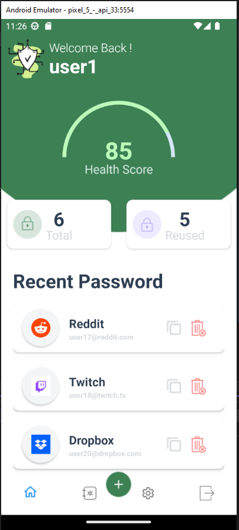
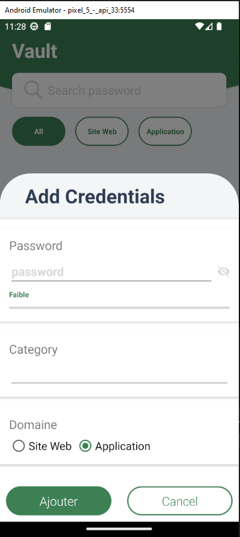
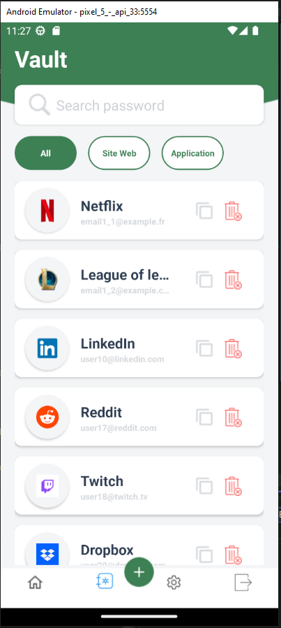

# 🛡️ GreenSecure - Gestionnaire de Mots de Passe

## 🌟 À propos
GreenSecure est une application conçue pour faciliter la gestion sécurisée des mots de passe. 🗝️ Développée avec Xamarin et C#, cette application offre une interface utilisateur intuitive pour stocker, organiser et accéder à vos mots de passe de manière sécurisée.

## 🎯 Caractéristiques
- **🔒 Stockage sécurisé** : Tous les mots de passe sont stockés de manière sécurisée.
- **👁️ Interface utilisateur intuitive** : Facile à naviguer pour une gestion efficace des mots de passe.
- **💻 Développé avec Xamarin et C#** : Utilisation de technologies modernes pour une performance optimale.

## 📸 Captures d'écran
### 🏠 Page d'Accueil

### ➕ Ajout de Mot de Passe

### 🔍 Vue d'Ensemble des Mots de Passe

---

💚 Développé avec passion par Nicolas
